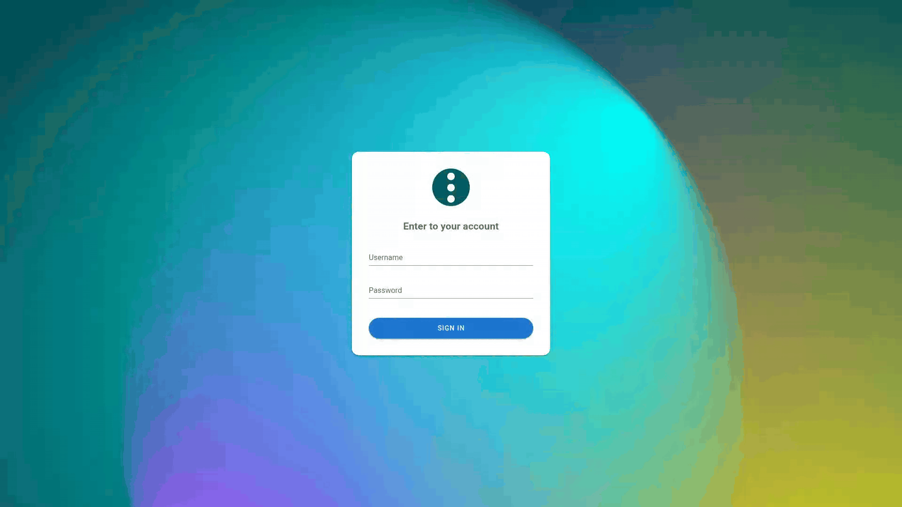

# Quickstart

Поднимите свой Semaphore и за 10 минут получите все task templates из этого репо.
В конце у вас будет: работающий Semaphore в Docker + 7 готовых шаблонов
(`ping`, `update`, `base`, `run_script`, `run_cmd`, `reboot`, `init`)
и успешный тестовый прогон `ping`.

Проверено на `semaphoreui/semaphore:v2.19.12`.

## Что понадобится

- `git`, `docker compose`, `python3` (только для запасного пути без UI).
- 10 минут и доступ в интернет (Docker Hub + ваш git-хостинг).
- Ваши хосты и SSH-ключ — понадобятся на шагах 2–4.

## Короткая версия

```bash
git clone <this-repo> && cd ansible
cp .env.example .env && nano .env   # свои пароли + ключ шифрования
docker compose up -d                # http://localhost:3000
```

Дальше всё в браузере: проект → ключ → репозиторий → inventory →
variable group → API-токен → шаблон `00-bootstrap` → `Run`.
Подробности — ниже по шагам.

## Шаг 0. Секреты

```bash
cp .env.example .env
```

Откройте `.env` и задайте три вещи:

| Переменная | Что это |
|---|---|
| `SEMAPHORE_ADMIN_PASSWORD` | Пароль админа (по умолчанию `changeme` — смените) |
| `SEMAPHORE_ACCESS_KEY_ENCRYPTION` | Ключ шифрования секретов в БД, сгенерируйте: `head -c32 /dev/urandom \| base64` |

Файл `.env` уже в `.gitignore` — в репозиторий он не попадёт.

Запуск:

```bash
docker compose up -d
```

Проверка: `curl -s http://localhost:3000/api/ping` должен вернуть `pong`,
а в браузере открыться страница логина `http://localhost:3000`.



## Шаг 1. Логин и проект

Зайдите как `admin` с паролем из `.env`. Пустой инстанс сразу предложит
создать проект — назовите его `ansible` и нажмите `Create`.

Как узнать ID проекта: откройте проект — цифра в адресе
(`http://localhost:3000/project/1/...`) и есть ID. У первого проекта это `1`,
он понадобится на шаге 8.


## Шаг 2. Key Store

Откройте `Key Store`. Встроенный ключ `None` уже на месте — его достаточно
для публичного репозитория. Свой SSH-ключ для доступа на VPS добавьте здесь же
через `New Key` (понадобится на шаге 4 как `User Credentials` и для приватных реп).


## Шаг 3. Repository

`Repositories -> New Repository`:

- `Name`: `ansible` — имя важно, его ищет `semaphore/templates.json`;
- `URL or path`: https-URL **этого** репозитория (свой форк);
- `Branch / Tag`: `main`;
- `Access Key`: `None` для публичного репозитория, свой SSH-ключ для приватного.

Нажмите `Create`. Репозиторий появится в списке — клонирование произойдёт
при первом запуске задачи, сейчас проверять нечего.


## Шаг 4. Inventory

`Inventory -> New Inventory -> Ansible Inventory`:

- `Name`: `main` — имя важно, его ищет `semaphore/templates.json`;
- `Type`: `Static`;
- `User Credentials`: ваш SSH-ключ (для первой проверки сойдёт `None`);
- в редактор вставьте свои хосты в INI-формате, например:

```ini
[stage]
vps-stage-01 ansible_host=203.0.113.20 ansible_user=debian ansible_port=22
```

Нажмите `Create`. Должна появиться строка `main / static`.


## Шаг 5. Variable Groups

`Variable Groups -> New Group`: имя `empty`, остальное не трогайте,
нажмите `Save`. Секреты и переменные окружения добавляются сюда же позже,
шаблонам пустой группы достаточно.


## Шаг 6. API-токен

Меню пользователя справа сверху -> `API Tokens -> New Token`:
имя например `bootstrap`, `Expires: Never`, `Create`.
**Токен показывается один раз — скопируйте его сразу**, он нужен на шаге 8.
Если потеряли — удалите и выпустите новый, это штатно.


## Шаг 7. Включите приложение Python

Откройте `Task Templates -> New template`. Если в меню есть только
`Ansible Playbook`, `Bash Script` и остальные, а `Python Script` нет —
это нормально: приложение выключено по умолчанию.

В том же меню выберите `Applications` — откроется страница приложений.
Найдите строку `Python Script` и включите тумблер. Вернитесь в
`Task Templates -> New template` — пункт `Python Script` появится.


## Шаг 8. Шаблон 00-bootstrap

`Task Templates -> New template -> Python Script`, заполните:

- `Name`: `00-bootstrap`;
- `Repository`: `ansible`;
- `Script Filename`: `scripts/semaphore_bootstrap.py`;
- `Survey Variables` (кнопка `+ Add variable`, каждого по одному):
  - `Name: token`, `Title: API Token`, `Type: Secret`, галочка `Required`;
  - `Name: project_id`, `Title: Project ID`, `Type: String` (по умолчанию),
    галочка `Required`.

Нажмите `Create`. Это единственный шаблон, который создаётся руками, —
остальные создаст он сам.


## Шаг 9. Run — сидинг шаблонов

Откройте `00-bootstrap -> Run`, введите `token` с шага 6 и `project_id`
с шага 1 (например `1`), нажмите `Run`.

Успешный лог заканчивается строкой вида:

```text
[update] ping (id=1, playbooks/ping.yml)
...
done: created=7 updated=0 unchanged=0 dry_run=False
```


(при первом запуске — `created=7`, при повторных — `updated=7`).
В `Task Templates` теперь 7 шаблонов: `ping`, `update`, `base`,
`run_script`, `run_cmd`, `reboot`, `init` — у всех inventory `main`,
репозиторий `ansible`, группа `empty`.

Повторный `Run` — это и есть обновление: скрипт сверяет записи по имени,
создаёт недостающие (`POST`) и обновляет изменившиеся (`PUT`).
После `git pull` с новыми шаблонами просто нажмите `Run` ещё раз.

Запасной путь без UI (тот же скрипт локально, нужен только `python3`):

```bash
SEMAPHORE_URL=http://localhost:3000/api SEMAPHORE_TOKEN=xxx SEMAPHORE_PROJECT_ID=1 \
  python3 scripts/semaphore_bootstrap.py --dry-run   # что изменится
SEMAPHORE_URL=http://localhost:3000/api SEMAPHORE_TOKEN=xxx SEMAPHORE_PROJECT_ID=1 \
  python3 scripts/semaphore_bootstrap.py              # применить
```

## Шаг 10. Проверка: тестовый ping

`ping -> Run`, в поле `Target` введите группу или хост из своего inventory
(например `stage`), `Run`. Успех — `ok=1 unreachable=0 failed=0` в выводе.


Готово — стенд рабочий. Дальше смотрите `README.md`: описание переменных
и survey-полей каждого плейбука.

> Осторожно с `init` и `reboot`: первый прогон `init` — строго с `Limit`
> на одну тестовую ноду (подробности в `README.md`), а `reboot` не спрашивает
> подтверждения — не запускайте его на `all` без нужды.

## Обновление шаблонов (день второй)

1. `git pull` — забираете свежие `playbooks/` и `semaphore/templates.json`;
2. `Run` на `00-bootstrap` — шаблоны обновляются;
3. ничего лишнего скрипт не удаляет: переименованный шаблон оставит старый
   дубль — удалите его в UI руками.

## Troubleshooting

| Симптом | Причина и лечение |
|---|---|
| `Inventory "main" not found in project. Known: ...` | В проекте нет inventory с таким именем. Создайте с именем из `semaphore/templates.json` (раздел `defaults`) или поправьте JSON под свои имена и перезапустите задачу |
| `Repository "ansible" not found` | То же самое для репозитория |
| Задача `00-bootstrap` падает на клонировании репозитория | Проверьте URL репозитория и Access Key: приватный репозиторий требует SSH-ключ, а не `None` |
| В `New template` нет `Python Script` | Включите приложение на странице `Applications` (шаг 7) |
| Потеряли API-токен | Токены не показываются повторно: удалите старый, выпустите новый |
| `PUT .../templates/N -> HTTP 400` на старой версии скрипта | Обновите `scripts/semaphore_bootstrap.py` (`git pull`): свежий скрипт передаёт `id` в теле `PUT`, этого требует API |

## FAQ

- **Почему не Terraform-провайдер?** Официальный провайдер не умеет
  `text`-переменные (а у нас `ssh_keys`, `*_env` — именно `text`) и тянет
  `tfstate`. API-скрипт на stdlib проще для чужого человека.
- **Можно ли хранить inventory в репозитории?** Да, но тогда секреты
  соединений уедут в git. Принцип этого репо: inventory и секреты живут
  в UI, в git их нет.
- **sqlite vs postgres?** В `compose.yml` — sqlite: один контейнер,
  годится для homelab и демо. Бекап — копией volume `semaphore-data`
  при остановленном контейнере. Для продакшна переключитесь на postgres —
  шаблоны и скрипт менять не нужно.
